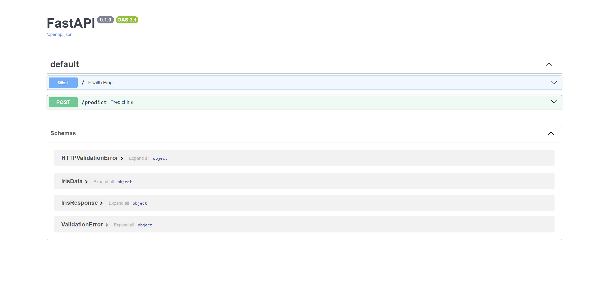

## Overview

This is a FastAPI-based machine learning API for predicting Iris flower species using scikit-learn. The app loads a trained model and exposes REST endpoints for predictions and health checks.

**FastAPI**: FastAPI is a modern, fast (high-performance), web framework for building APIs with Python based on standard Python type hints.

**uvicorn**: Uvicorn is an [Asynchronous Server Gateway Interface - ASGI](https://youtu.be/vKjCkeJGbNk) web server implementation for Python. It is often used to serve FastAPI aplications.

The workflow involves the following steps:
1. Training a Decision Tree Classifier on Iris Dataset.
2. Serving the trained model as an API using FastAPI and uvicorn.

## Setting up the lab

1. Create a virtual environment(e.g. **fastapi_lab1_env**).
2. Activate the environment and install the required packages using `pip install -r requirements.txt`.

## Running the Lab

1. First step is to train a Decision Tree Classifier(Although you have **`model/iris_model.pkl`** when you cloned from the repo, let's create a new model). To do this, move into **src/** folder with
    ```bash
    cd src
    ```
2. To train the Decision Tree Classifier, run:
    ```bash
    python train.py
    ```
3. To serve the trained model as an API, run:
    ```bash
    uvicorn main:app --reload
    ```
- In this command, **main** is the name of the Python file containing your app instance (without the .py extension), and **app** is the name of the instance itself. The **--reload** flag tells uvicorn to restart the server whenever code changes are detected, which is useful during development and should not be used in production.
4. Testing endpoints - to view the documentation of your api model you can use [http://127.0.0.1:8000/docs](http://127.0.0.1:8000/docs) (or) [http://localhost:8000/docs](http://localhost:8000/docs) after you run you run your FastAPI app.
    

   
You can also test out the results of your endpoints by interacting with them. Click on the dropdown button of your endpoint -> Try it out -> Fill the Request body -> Click on Execute button.

You will get a response similar to the one below:

```bash
{
  "response": 0,
  "class_name": "Setosa"
}
```
In the above, the response 0 serves to class = "Setosa", response 1 serves to class = "Versicolor", and response 2 serves to class = "Virginica"
